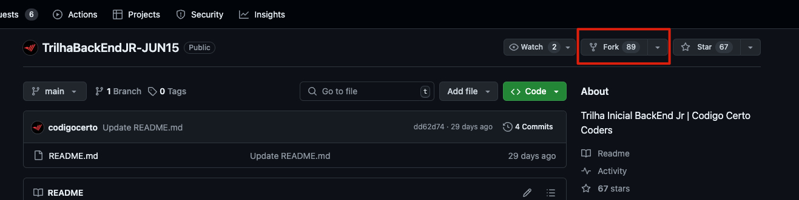
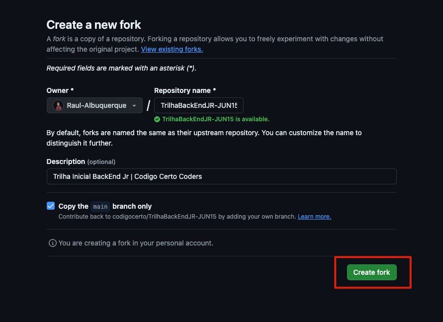
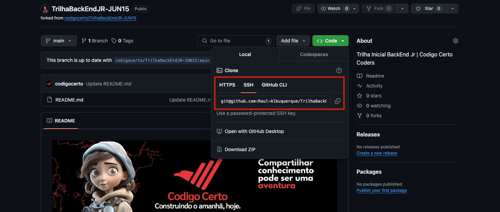

## Como faço minha trilha? 🤔

#### [Assistir Tutorial](https://youtu.be/DVEmFhOuXQ4)

---
### Guia para realização da trilha:

1. **Leia todos os requisitos da sua trilha com bastante atenção 🔍.**

2. **Faça o fork do repo da trilha escolhida:**
  

3. **Crie o fork:**
  

4. **Acesse o link para clonar o repositório recém criado:**
  
  Obs.: Caso tenha uma chave SSH opte por clonar utilizando ela, caso contrário, utilize o link https. 

5. **Abra o seu terminal**

6. **Navegue até o caminho que deseja salvar seu projeto**

7. **Crie uma pasta para seu projeto:**
    ```shell
      ## Síntaxe
      mkdir nomedoprojeto

      ## Exemplo
      mkdir trilhaback-exemplo
    ```

8. **Acesse a pasta do seu projeto:**
    ```shell
      ## Síntaxe
      cd nomedapastadoprojeto

      ## Exemplo
      cd trilhaback-exemplo
    ```

9. **Clone o seu projeto remoto para o ambiente local:**

    ```shell
    ## Síntaxe
    git clone url .

    ## Exemplo
    git clone git@github.com:Raul-Albuquerque/TrilhaBackEndJR-JUN15.git .
    ```

10. **Abra a sua IDE de preferência:**
    ```shell
    code . 
    ```

11. **Agora é só você fazer a sua mágica🔮 e subir as alterações para o repositório remoto.**

<br>

---

### Dicas Bônus:

 - #### Leia atentamente os requisitos da sua trilha.
 - #### Tente utilizar os padrões de [Commits Semânticos](https://github.com/iuricode/padroes-de-commits).
 - #### Durante o desenvolvimento, busque sempre ter organização em seu código.
 - #### Algumas trilhas têm uma stack já definida, sendo interessante utilizá-la, mesmo que não tenha experiência.

